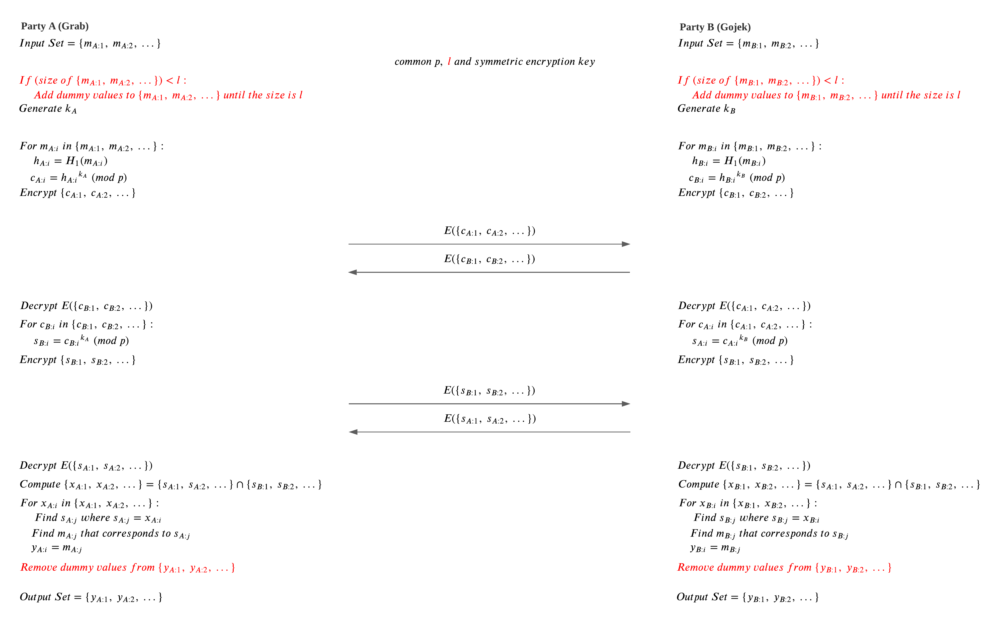

# Team G-JJ's Private Set Intersection Algorithm
In this project, we designed and implemented several algorithms for secure and private set intersection.


## Contents
- [Motivation](#motivation)
- [Use of Code](#use-of-code)
- [Algorithm Design](#algorithm-design)
    - [V1.0: Basic DH Algorithm](#v1.0:-basic-dh-algorithm)
        - [V1.1: Basic DH Algorithm with Padding](#v1.1:-basic-dh-algorithm-with-padding)
        - [V1.2: Basic DH Algorithm with Verification](#v1.2:-basic-dh-algorithm-with-verification)
    - [V2: Meadows DH Algorithm](#v2:-meadows-dh-algorithm)
- [Design Considerations](#design-considerations)
    - [No Collisions](#no-collisions)
- [Security](#security)
- [External Libraries](#external-libraries)
- [References](#references)


## Motivation 
[(go to top)]

Grab and Gojek want to identify the drivers who are double-dipping on both platforms while using the same hired vehicle and the same phone number for receiving orders (assuming this behavior is against the individual contracts).
- Parties should be able to compute the intersection of two sets (phone numbers) without disclosing the sets.
- No party should gain any knowledge about sets of other parties (prevent poaching of drivers in the example).
- Every party should gain the knowledge about final intersection set (the common phone numbers are revealed).


## Use of Code
[(go to top)]  
Note: ensure Requirements have been satisfied
### v1.0 - The basic algorithm
To run the notebook, simply click `Kernel -> Restart & Run All`  
#### Change phone number count
Edit the following cell in the notebook
```python
# set phone number count
gojek_phone_number_count = 61 # inclusive of phone numbers in common with grab
grab_phone_number_count = 91 # inclusive of phone numbers in common with gojek
common_phone_number_count = 10
```

#### Change key size
Edit the following cell in the notebook
```python
# assign pre-determined variables for psi
key_size = 1024 # both private keys and large prime
```

### v1.1 - Prevent man-in-the-middle attack with symmetric key encryption!
To run the notebook, simply click `Kernel -> Restart & Run All`  
Everything mentioned in [v1.0](#v1.0-the-basic-algorithm) is applicable
### v1.2 - Prevent set size reveal with padding!
To run the notebook, simply click `Kernel -> Restart & Run All`  
Everything mentioned in [v1.1](#v1.1-prevent man-in-the-middle-attack-with-symmetric-key-encryption!) is applicable

#### Change set size
Edit the following cell in the notebook
```python
# set set-size
set_size = 100 # both parties are to exchange sets of a pre-determined size

# set phone number count
gojek_phone_number_count = 61 # inclusive of phone numbers in common with grab
grab_phone_number_count = 91 # inclusive of phone numbers in common with gojek
common_phone_number_count = 10
```
### v2.0 - Detect shuffling of encrypted set with commit mechanism!
To run the notebook, simply click `Kernel -> Restart & Run All`  
Everything mentioned in [v1.2](#v1.2-prevent-set-size-reveal-with-padding!) is applicable
#### Try shuffling the encrypted set
Edit the following cell to make one party shuffle the encrypted set and send the wrong order to the other party
```python
# clients encrypt other party's self encrypted set
grab.encrypt_set(True) # set is_other_party to true
# grab.encrypt_set(True, True) # set shuffle to true to make grab shuffle the encrypted set
gojek.encrypt_set(True)
# gojek.encrypt_set(True, True)
```
* In the example given below, uncomment `grab.encrypt_set(True, True)` and comment out `grab.encrypt_set(True)` 
to make Grab shuffle the encrypted set
```python
# clients encrypt other party's self encrypted set
# grab.encrypt_set(True) # set is_other_party to true
grab.encrypt_set(True, True) # set shuffle to true to make grab shuffle the encrypted set
gojek.encrypt_set(True)
# gojek.encrypt_set(True, True)
```
* Gojek ends up finding the wrong intersection while Grab still arrives at the correct intersection

* Gojek is able to find out that Grab cheated


## Algorithm Design 
[(go to top)]

We have chosen to use an adapted version of the Diffie-Hellman key exchange algorithm for our PSI design. We have listed several versions of our algorithm below, each with varying levels of security and complexity.

<ins>Notation</ins>
| Notation | Definition |
| --- | --- |
| ![p] | common safe prime used in the Diffie-Hellman exchange to perform modular calculation|
| ![q] | Sophie Germain prime used to generate ![p]
| ![hash function] | function that hashes a value into a primitive root modulo ![p] |
| ![symmetric encrpytion] | message m being encrypted by symmetric encryption
| ![key] | private Diffie-Hellman key of party ![party] |
| ![common size] | size of plaintext list that parties agree on
| ![plaintext] | ![i]-th message of party ![party] in plaintext |
| ![hashed text] | ![i]-th message of party ![party] after it has been hashed using ![hash function] |
| ![ciphertext] | ![i]-th message of party ![party] in ciphertext, after it has been encrypted by party ![party]'s private key |
| ![shared ciphertext] | ![i]-th message of party ![party] in ciphertext, after it has been encrypted by both parties' private keys
| ![common ciphertext] | ![i]-th element in the common ciphertext set intersection computed by party ![party] |
| ![common plaintext] | ![i]-th element in the common plaintext set intersection computed by party ![party] |

[p]: https://latex.codecogs.com/png.image?%5Cdpi%7B100%7D%20p
[//]: # "p"
[q]: https://latex.codecogs.com/png.image?%5Cdpi%7B100%7D%20q
[//]: # "q"
[party]: https://latex.codecogs.com/png.image?%5Cdpi%7B100%7D%20A
[//]: # "A"
[i]: https://latex.codecogs.com/png.image?%5Cdpi%7B100%7D%20i
[//]: # "i"
[common size]: https://latex.codecogs.com/png.image?%5Cdpi%7B100%7D%20l
[//]: # "l"
[hash function]: https://latex.codecogs.com/png.image?%5Cdpi%7B100%7D%20H
[//]: # "H"
[symmetric encrpytion]: https://latex.codecogs.com/png.image?%5Cdpi%7B100%7D%20E(m)
[//]: # "E(m)"
[key]: https://latex.codecogs.com/png.image?%5Cdpi%7B100%7D%20k_%7BA%7D
[//]: # "k_{A}"
[plaintext]: https://latex.codecogs.com/png.image?%5Cdpi%7B100%7D%20m_%7BA:i%7D
[//]: # "m_{A:i}"
[hashed text]: https://latex.codecogs.com/png.image?%5Cdpi%7B100%7D%20h_%7BA:i%7D
[//]: # "h_{A:i}"
[ciphertext]: https://latex.codecogs.com/png.image?%5Cdpi%7B100%7D%20c_%7BA:i%7D
[//]: # "c_{A:i}"
[shared ciphertext]: https://latex.codecogs.com/png.image?%5Cdpi%7B100%7D%20s_%7BA:i%7D
[//]: # "s_{A:i}"
[common ciphertext]: https://latex.codecogs.com/png.image?%5Cdpi%7B100%7D%20x_%7BA:i%7D
[//]: # "x_{A:i}"
[common plaintext]: https://latex.codecogs.com/png.image?%5Cdpi%7B100%7D%20y_%7BA:i%7D
[//]: # "y_{A:i}"


### V1.0: Basic DH Algorithm
[(go to top)]

In version 1.0 and its sub-versions, we assume that the parties are honest but curious. The parties being honest means they will not deviate from the protocol. However, the parties being curious means that they will try to find out as much as possible about the other party's set thorough other means, such as perfomring dictionary attacks.

We have based this algorithm off of Clark's algorithm [[ref]](#references). We use 1024-bit safe prime for ![p] and 1024-bit private keys for both parties.

The algorithm is as follows:


The security of Diffie-Hellman is based on the assumed difficulty of the discrete logarithm problem. For a Diffie-Hellman protocol to leverage this, it must use generators that are primtive roots modulo ![p]. In our algorithm, the "generators" being used are the plaintext messages. Hence, for our algorithm to be secure, the plaintext messages must be first hashed to primitive roots. 

In our hash function ![hash function], we repeatedly hash a message using SHA-256 until we get a value that is a primitive root. The number of primitive roots modulo ![p] is ![toitent p-1] [[ref]](#references). In our algorithm, where ![safe prime equation], the number of primtive roots will be ![primitive root no]. This means that for numbers ranging from 1 to ![p-1], aprroximately half of the numbers will be primitive roots. Consequently, our hash function ![hash function] will run 2 rounds of SHA-256 on average before it produces a primtive root.


[toitent p-1]: https://latex.codecogs.com/png.image?%5Cdpi%7B100%7D%20%5Cphi(p-1)%20
[//]: # "\phi(p-1)"
[primitive root no]: https://latex.codecogs.com/png.image?%5Cdpi%7B100%7D%20q-1
[//]: # "q-1"
[safe prime equation]: https://latex.codecogs.com/png.image?%5Cdpi%7B100%7D%20p=2q&plus;1
[//]: # "p=2q+1"


#### Security
<ins>Refusing to Send Phone Numbers</ins>

Consider a scenario where Grab chooses to withhold some of its phone numbers and not include them in the onput set. However, in order for Grab to know whether those phone numbers are common phone numbers, it would need Gojek to encrypt the numbers with its private key. Hence, Grab has no choice but to include all its phone numbers in the algorithm. The same also applies for Gojek.

<ins>Dictionary Attack</ins>

For a party to run a dictionary attack, it would first have to find the private key of the other party. For a 1024-bit private key, there are ![private key number] possible values that the party would have to iterate through to find the key. Hence, it would be computationally infeasible for either party to perform a dictionary attack. The same also applies for external attackers.

[private key number]: https://latex.codecogs.com/png.image?%5Cdpi%7B100%7D%202%5E%7B1023%7D
[//]: # "2^{1023}"

<ins> Pohlig-Hellman Attack </ins>


### V1.1: DH Algorithm with Symmetric Encryption
[(go to top)]

This is an improvment of the version 1.0 algorithm. On top of the base algorithm, we add symmetric encryption.

The algorithm is as follows (additions have been included in red):


The security of this algorithm would depend on the strenght of the symmetric encryption scheme used. We have chose Fermet encryption for _____________.


#### Security
  
<ins> Man-in-the-Middle (MITM) Attacks </ins>

In the previous version, as with all Diffie-Hellman protocols, the algorithm is vulnerable to MITM attacks. However, in this version, without the shared symmetric key that the parties are using, there would be no way for an external attacker to pretend to be either party. Hence, this algorithm is safe from MITM attacks.


### V1.2: Basic DH Algorithm with Padding
[(go to top)]

This is an improvment of the version 1.1 algorithm. On top of the base algorithm and symmetric encryption, we add padding of phone numbers.

The algorithm is as follows (additions have been included in red):



In this version of the algorithm, the list is padded with random dummy values until the size of the list matches ![common size], which is a common size that the two parties agree on. Each dummy value is 9 digits as a 9 digit number cannot be a valid Singaporean phone number. The dummy values do not affect the final set intersection, as any dummy values that appear in the computed set intersection are filtered out.


#### Security

<ins> Set Size Leaked </ins>

In the previous versions, Grab would be able to find out Gojek's set size from the number of elements in the set Gojek sends over, and vice versa. However, in this version of the algorithm, both sets are padded to size ![common size] with random dummy numbers. Since parties would not be able to distinguish between the encrypted ciphertexts of actual phone numbers and the dummy numbers, the set size of both parties is successfully hidden.


### V2: DH Algorithm with Result Verification
[(go to top)]

In this version, we assume that the parties are semi-honest. This means that, in addition to trying to gain information on the other party's set, they will also try to mess up the other party's intersection results if possible. They may do so by not following certain parts of the protocol. In particular, the parties may try to shuffle the ciphertexts. 


## Design Considerations
[(go to top)]

### Secret from Each Party
A secure PSI protocol needs to use a "secret" from each party [[ref]](#references). Hence, we have chosen to base our algorithm off the Diffie-Hellman key exchange protocol. In our algorithms, the "secrets" used from each party are the Diffie-Hellman private keys.


### No Collisions
[(go to top)]

In order for the parties to correctly find the common intersection, each phone number must map to a unique cipher text. There are 2 possible areas in our algorithm where collisions could occur &mdash; hashing and encryption.

<ins>Hashing</ins>

Singaporean phone numbers have the format +65 XXXX YYYY and mobile phone numbers start with 8 or 9. There are 19,999,999 possible phone numbers in Singapore. Using the taylor series approximation to the birthday problem, the probability of a collision is approximately ![taylor series approximation] [[ref]](#references), where ![n] is the number of unique phone numbers and ![d] is the number of unique hash values. For SHA-256, there are ![2^255] hash values. In the worst case scenario, using ![hashing d] and maximum ![max n], the probability of collision will be approximately ![hashing collision prob].

[taylor series approximation]: https://latex.codecogs.com/png.image?%5Cdpi%7B100%7D%201-e%5E%7B-%5Cfrac%7Bn%5E%7B2%7D%7D%7B2d%7D%7D
[//]: # "1-e^{-\frac{n^{2}}{2d}}"
[n]: https://latex.codecogs.com/png.image?%5Cdpi%7B100%7D%20n 
[//]: # "n"
[d]: https://latex.codecogs.com/png.image?%5Cdpi%7B100%7D%20d
[//]: # "d"
[2^255]: https://latex.codecogs.com/png.image?%5Cdpi%7B100%7D%202%5E%7B255%7D
[//]: # "2^{255}"
[hashing d]: https://latex.codecogs.com/png.image?%5Cdpi%7B100%7D%20d=2%5E%7B255%7D
[//]: # "d=2^{255}"
[max n]: https://latex.codecogs.com/png.image?%5Cdpi%7B100%7D%20n=19,999,999 
[//]: # "n=19,999,999"
[hashing collision prob]: https://latex.codecogs.com/png.image?%5Cdpi%7B100%7D%203.45%20%5Ctimes%2010%5E%7B-63%7D
[//]: # "3.45 \times 10^{-63}"

<ins>Encryption</ins>

Since all the hashed values are primitive roots, all phone numbers can generate up to ![p-1] values when encrypted. In the worst case scenario, using minimum ![encryption d] and maximum ![max n], the probability of collision will be approximately ![encryption collision prob].

[p-1]: https://latex.codecogs.com/png.image?%5Cdpi%7B100%7D%20p-1
[//]: # "p-1"
[encryption d]: https://latex.codecogs.com/png.image?%5Cdpi%7B100%7D%20d=2%5E%7B1023%7D-1 
[//]: # "d=2^{1023}-1"
[collision probability]: https://latex.codecogs.com/png.image?%5Cdpi%7B100%7D%20%5Cleft%20(%202.23%20%5Ctimes%2010%5E%7B-294%7D%20%5Cright%20) 
[//]: # "\left ( 2.23 \times 10^{-294} \right )"
[encryption collision prob]: https://latex.codecogs.com/png.image?%5Cdpi%7B100%7D%202.23%20%5Ctimes%2010%5E%7B-294%7D
[//]: # "2.23 \times 10^{-294}"

<ins>Overall</ins>

For each phone number, the hashing occurs once and the encryption occurs twice, hence:

![collision prob formula]

Therefore, the probability of collision in our algorithm is approximately ![collision prob], which is negligible.

[collision prob formula]: https://latex.codecogs.com/png.image?%5Cdpi%7B100%7D%20Pr(no%5C%20collision)=Pr(no%5C%20collision%5C%20in%5C%20hashing)%20%5Ctimes%20Pr(no%5C%20collision%5C%20in%5C%20encryption)%5E%7B2%7D
[//]: # "3.45 \times 10^{-63}"
[collision prob]: https://latex.codecogs.com/png.image?%5Cdpi%7B100%7D%203.45%20%5Ctimes%2010%5E%7B-63%7D
[//]: # "3.45 \times 10^{-63}"


## Limitations
### Computational Time Trade-Off


### Guessing Phone Numbers
Consider a scenario where Grab suspects that Gojek has the phone number 9999 9999. Grab could add this phone number to its input set. If the number appears in the intersection set, Grab would know definitely that Gojek has the phone number 9999 9999. Grab would be able to this for any phone number it suspects is in Gojek's set. Similarly, Gojek would also be able to do the same. 

Unfortunately, none of our algorithms would be able to stop the parties from trying to guess phone numbers from the other party's set. In order for this problem to be solved, a credible and trusted third party organisation would have to be involved. The third party organisation would have to verify that both parties only include their own phone numbers in their input sets.


### Sending Wrong Encryption Values
Consider a scenario where Grab wants to hide the set intersection values from Gojek. When Grab is supposed to send the values of ![gojek shared ciphertext], it instead sends randomly generated nonsense. As a result, Gojek does not find any common ciphertext and wrongly concludes that there is no intersection between the sets. In such a scenario, Gojek would have no way of finding out this occured, as the values encrypted by Grab would appear pseudo-random to Gojek.

Unfortunately, none of out algorithms would be able to stop the parties from doing this or even detecting that the parties have done it. However, in our research we have found an algorithm by Meadows [[ref]](#references) wh ich addresses this problem

[gojek shared ciphertext]: https://latex.codecogs.com/png.image?%5Cdpi%7B100%7D%20s_%7BGojek:i%7D
[//]: # "s_{Gojek:i}"

## External Libraries
[(go to top)]

### Cryptographic libraries
#### cryptography
`cryptography.hazmat.primitives.asymmetric.dh.generate_parameters(generator,key_size)` 
used to generate random safe prime for prime modulus
* [documentation](https://cryptography.io/en/latest/hazmat/primitives/asymmetric/dh/#group-parameters)

`cryptography.fernet.Fernet` used for symmetric key encryption  
* [documentation](https://cryptography.io/en/latest/fernet/)
* `Fernet` is a high level symmetric encryption recipe provided by `cryptography`
* `Fernet` uses:
  * `AES` in `CBC` mode with a `128-bit key` for encryption; using `PKCS7` padding
  * `HMAC` using `SHA256` for authentication
  * `os.urandom()` for generation of IV
  * [source](https://cryptography.io/en/latest/fernet/#implementation)  

#### hashlib
`hashlib.sha256` used for hashing messages  
* [documentation](https://docs.python.org/3/library/hashlib.html#hash-algorithms)
* `hashlib` uses `SHA3` from `OpenSSL 1.1.1` and newer
  * [source](https://docs.python.org/3/library/hashlib.html#hash-algorithms)  


#### sympy
`sympy.ntheory.primetest.isprime(n)` used to check if n is prime
* [documentation](https://docs.sympy.org/latest/modules/ntheory.html#sympy.ntheory.primetest.isprime)
* For n larger than 2<sup>64</sup>, a strong BPSW test is performed. 
  * [source](https://docs.sympy.org/latest/modules/ntheory.html#sympy.ntheory.primetest.isprime)  

#### secrets
`secrets.randbits(size)` used to generate random numbers of bit-size 1024 for clients' private secret
* [documentation](https://docs.python.org/3/library/secrets.html#random-numbers)
* `secrets.randbits(size)` is a cryptographically secure random number generator


### Other libraries
#### random
`random.sample()` used to generate phone numbers and invalid phone numbers
* This usage does not require the generator to be cryptographically secure  

`random.shuffle()` used to shuffle the phone numbers
* This usage does not require the generator to be cryptographically secure

#### pandas
`pandas` used for displaying data as well as reading and writing to `.csv` files


## References
[(go to top)]

[] "Primitive Elements," 2008. [PDF document]. Available: http://homepages.math.uic.edu/~leon/mcs425-s08/handouts/PrimitiveElements.pdf. [Accessed: Nov. 27, 2021].

[] C. Meadows, "A More Efficient Cryptographic Matchmaking Protocol for Use in the Absence of a Continuously Available Third Party," in *1986 IEEE Symposium on Security and Privacy*, 1986, pp. 134–134. doi: 10.1109/SP.1986.10022.

[] W. Clark, "Private set intersection with Diffie-Hellman," *OpenMined Blog*, July. 9, 2020. [Online]. Available: https://blog.openmined.org/private-set-intersection-with-diffie-hellman/. [Accessed: Nov. 27, 2021].

[] "Approximations," *Wikipedia*. [Online]. Availabile: https://en.wikipedia.org/wiki/Birthday_problem#Approximations. [Accessed: Nov. 27, 2021].

[] "Special Topics on Privacy and Public Auditability &mdash; Event 2: A Brief Overview of Private Set Intersection," *CSRC | NIST*, Apr. 19, 2021. [Online]. Available: https://csrc.nist.gov/presentations/2021/a-brief-overview-of-private-set-intersection. [Accessed: Nov. 27, 2021].


[(go to top)]: #team-g-jj's-private-set-intersection-algorithm 